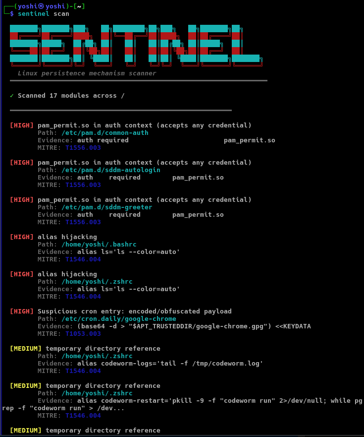
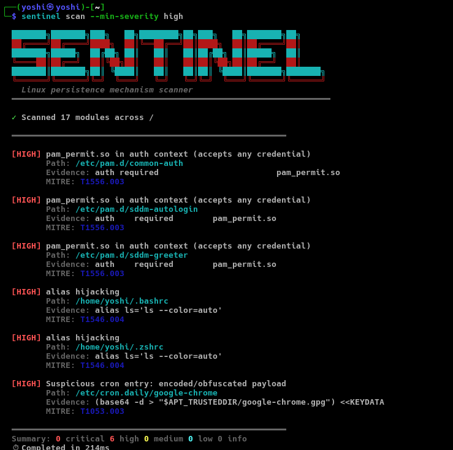
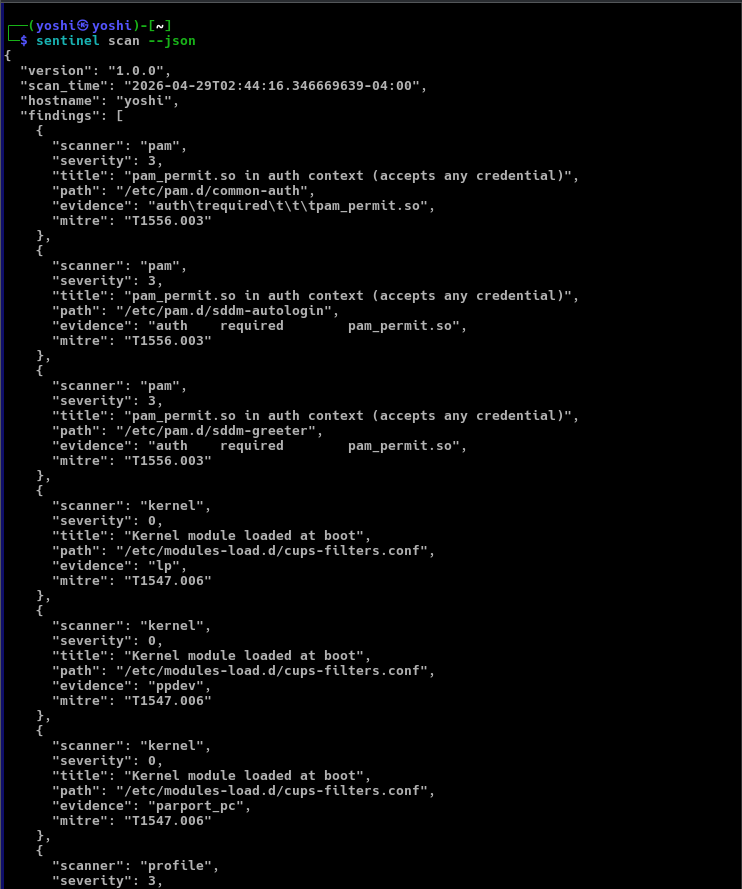

<!-- ©Anil Kumar | 2026 -->
<!-- DEMO.md -->

<div align="center">

```ruby
     _______. _______ .__   __. .___________. __  .__   __.  _______  __      
    /       ||   ____||  \ |  | |           ||  | |  \ |  | |   ____||  |     
   |   (----`|  |__   |   \|  | `---|  |----`|  | |   \|  | |  |__   |  |     
    \   \    |   __|  |  . `  |     |  |     |  | |  . `  | |   __|  |  |     
.----)   |   |  |____ |  |\   |     |  |     |  | |  |\   | |  |____ |  `----.
|_______/    |_______||__| \__|     |__|     |__| |__| \__| |_______||_______|
```

**Demo & Preview**

<br>

<a href="https://github.com/Anilokumar/linux-persistence-scanner">
  
</a>

<br>

```ruby
go install github.com/Anilokumar/linux-persistence-scanner/cmd/sentinel@latest
```

<br>

[Persistence Scan](#persistence-scan) · [JSON Output](#json-output) · [Minimum Severity Scan](#minimum-severity-scan)

</div>

---

### Persistence Scan

17-module sweep across systemd, cron, shell profiles, ld.so.preload, and PAM with severity scoring and MITRE ATT&CK technique mapping per finding



---

### Minimum Severity Scan

Structured findings for pipeline integration with severity minimum high.



---

### JSON Output

Structured findings for pipeline integration with scanner attribution, severity codes, evidence strings, and aggregate severity counts



